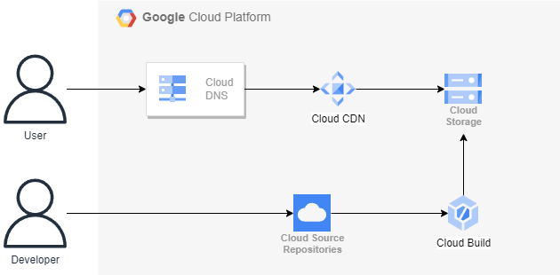

# GCP で IaC により静的ウェブサイトをデプロイするには
静的ウェブサイトを AWS 上ではなく GCP 上にデプロイする Terraform コードを書きました。

AWS 版は[こちら](https://blog.usaneko-xlarge.com/madeit/howtodeploythissite.html)

なお、今日の朝（5時間前）に初めて Terraform と GCP を触った人間なので、二度手間等はあるかもしれません。

## アーキテクチャ図
初めて GCP を触ったので間違っているかもしれませんが、おそらくこのようになっています。



Terraform でインフラをデプロイし Cloud Build により自動的にビルドが行われ、 Cloud Storage に静的ファイルが配置されることによって更新されます。
また、 Cloud CDN による配信も行っています。
以下、このサイトを作成する手順について書いていきます。
## 事前準備
1. [Terraform のインストール](https://developer.hashicorp.com/terraform/downloads)
2. [gcp でキーを作成](https://developer.hashicorp.com/terraform/tutorials/gcp-get-started/google-cloud-platform-build) し、`gcp-project-key.json` としてリポジトリ内に配置
3. `gcloud projects add-iam-policy-binding <YOUR GCLOUD PROJECT ID> --member=serviceAccount:<YOUR SERVICE ACCOUNT> --role=roles/source.admin` を CloudShell で実行（承認するポップアップが出てきたら承認を押す）
4. `gcloud projects add-iam-policy-binding <YOUR GCLOUD PROJECT ID> --member=serviceAccount:<YOUR SERVICE ACCOUNT> --role=roles/storage.admin` を CloudShell で実行（承認するポップアップが出てきたら承認を押す）

## インフラのデプロイ
```
cd infra
terraform init
terraform apply -var-file=vars.tfvars
```
おそらく以下のエラーが出るので、指示に従って URL を踏んで対処していきます

- Error 403: XXX API has not been used in project XXX before or it is disabled. Enable it by visiting ~ →この後に続くリンクを踏んで、指示に従って API を有効化します。
- You must verify site or domain ownership at ~ →この後に続くリンクを踏んで、あとは指示に従ってドメインの所有をしていることを証明します。さらに、そのあとに「プロパティに移動」し、「設定」「ユーザーと権限」から「ユーザーを追加」でサービスアカウントに OWNER 権限を追加してください。

Apply complete! が出たらインフラのデプロイは完了です。

## ビルド & デプロイ
GCP に SSH 認証鍵は設定しているものとします。
```
cd ../src
git init
git remote add google <cloud source repositories の URL>
git push --all google
```
branch の名前が main.tf 内の branch_name と一致していることを確認してください（main と master で違って動かないことがあります）
## 確認
https://storage.googleapis.com/（ドメイン名）/index.html
にアクセスするとウェブサイトが確認できます。
## 参考
- [Configuring Google Cloud CDN with Terraform](https://medium.com/cognite/configuring-google-cloud-cdn-with-terraform-ab65bb0456a9)
- [Google Cloud Storage Static Website](https://registry.terraform.io/modules/simplycubed/static-assets/google/latest/submodules/cloud-storage-static-website)
- [ビルド構成ファイルのスキーマ](https://cloud.google.com/build/docs/build-config-file-schema?hl=ja)
- [How to resolve "googleapi: Error 403: The caller does not have permission, forbidden"](https://stackoverflow.com/questions/67907211/how-to-resolve-googleapi-error-403-the-caller-does-not-have-permission-forbi)
